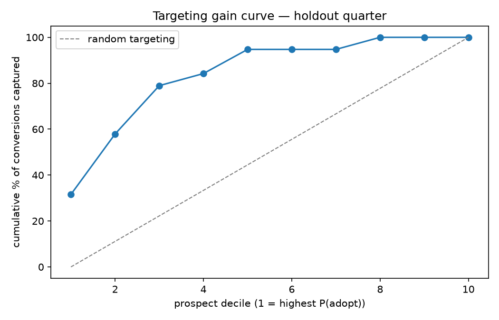

# advertiser-growth-prospecting

**Which prospective brands will become advertisers on a quick-commerce ads platform — and what will their first 90 days be worth?**

A two-stage supervised model that turns a prospect list into a ranked, tiered outreach pipeline:

1. **Conversion** — P(brand onboards within one quarter of a snapshot)
2. **Spend** — E[first-90-day spend | converted]; the two compose into an expected-value ranking

Built as a production-shaped DS project: config-driven stages, data-quality gates
(FAIL/WARN), leak-safe time-based splits, candidate tournaments with quarter-grouped
cross-validation, MLflow experiment tracking, pytest coverage, and a scoring contract
with a rule-based fallback.

---

## Results (held-out quarter, never seen in training)

| Metric | Value |
|---|---|
| Conversion ROC-AUC | **0.825** |
| Conversion top-decile lift | **3.2×** base rate |
| Spend MAE | **₹3.4 L** (~34% of mean spend) |
| End-to-end pipeline runtime | ~20 s |



The gain curve reads: calling the top decile of prospects first captures conversions at
3.2× the random-targeting rate. Calibration and spend diagnostics are in
[`reports/figures/`](reports/figures/); every number is in
[`reports/metrics/model_metrics.json`](reports/metrics/model_metrics.json).

## The data (fully synthetic — nothing sensitive)

The repo ships **no data**. A deterministic generator
([`src/ingestion/generate_data.py`](src/ingestion/generate_data.py)) emulates what an
ads-sales team knows about prospective brands, one snapshot per (brand, quarter):

- **Engagement**: web sessions, MAU estimates, sessions/MAU, PDP views, wishlist adds
- **Catalog health**: SKU count, in-stock rate, velocity index, content score, freshness
- **Category economics**: category GMV index & growth, brand share, AOV, discount depth
- **Competitive pressure**: competitor spend, # advertisers, share-of-voice gap
- **Readiness**: historical ad spend, digital maturity, agency flag, D2C store, demo given
- **Contact context**: channel, outreach attempts, last action (ghosted → negotiating)

Under the hood, a quarterly **conversion hazard** (driven by digital maturity, demo
activity, engaged last actions, spend history) decides which brands onboard; converters
draw a gamma-distributed first-90-day spend. The base rate decays across quarters
(0.29 → 0.09) as eager brands convert first — the realistic prospecting-pipeline aging
pattern that makes time-based evaluation honest.

Fixed seed ⇒ byte-identical reruns. `scripts/generate_data.py` regenerates everything
into `data/raw/` (gitignored).

## Repo layout

```
configs/config.yaml        # every knob: gates, features, splits, hyperparameters
src/
  ingestion/               # synthetic generator + raw loader
  validation/              # DQ gates (FAIL blocks, WARN logs) + audit report
  features/                # leak-safe matrix builder + chronological splits
  training/                # conversion & spend tournaments (MLflow-tracked)
  evaluation/              # metrics, gain/calibration/spend figures
  inference/               # scoring contract w/ rule-based fallback
scripts/
  generate_data.py         # regenerate data/raw
  run_pipeline.py          # end-to-end: generate → gates → features → train → eval
  score_prospects.py       # score newest quarter → tiered outreach list
tests/                     # 14 pytest cases (determinism, leaks, contracts)
reports/                   # committed: gate reports, metrics, figures, outreach list
```

## Running it

```bash
python -m venv .venv
.venv/Scripts/pip install -r requirements.txt     # (Linux/macOS: .venv/bin/pip)
.venv/Scripts/python scripts/run_pipeline.py      # ~20 s end to end
.venv/Scripts/python scripts/score_prospects.py   # outreach list for the newest quarter
.venv/Scripts/python -m pytest tests/ -q          # 14 tests
```

(Linux/macOS: use `.venv/bin/python` instead of `.venv/Scripts/python`.)

## Design decisions worth defending

- **Time-based splits, never random.** Later quarters are unseen in training; the newest
  quarter is structurally unlabeled (its outcome window hasn't closed) and is served as
  the production scoring batch. Cross-validation folds are grouped by quarter, so no
  quarter leaks across folds.
- **Champion on PR-AUC for conversion.** Conversion is imbalanced (8–27% depending on
  quarter vintage) and outreach is expensive — precision matters more than ROC-AUC.
- **Spend trains on the positive cohort only**, on a log1p target, and composes with the
  conversion model as `E[value] = P(adopt) × E[spend | adopt]` at inference.
- **Train-only fit statistics.** Winsorization bounds, imputation medians and category
  encodings are fit on training quarters and persisted with the model bundle, so the
  inference matrix is built with identical transforms — the classic production-drift trap.
- **Gates before models.** The orchestrator refuses to train on data that fails its
  quality gates; every run leaves an auditable `gate_report.{json,md}`.

## Scoring contract

`score_batch()` emits a tiered outreach list for the newest (unlabeled) snapshot:

| Priority | Rule |
|---|---|
| 1 | P(adopt) ≥ 0.45 **and** predicted spend in the top quartile |
| 2 | P(adopt) ≥ 0.45 |
| 3 | P(adopt) ≥ 0.225 (watchlist) |

If the model bundles are absent (e.g. before a first training run), a deterministic
rule-based fallback keeps the script useful. A schema test asserts the output is
internally consistent (EV = P × spend, recomputable from the CSV).

## License

MIT
